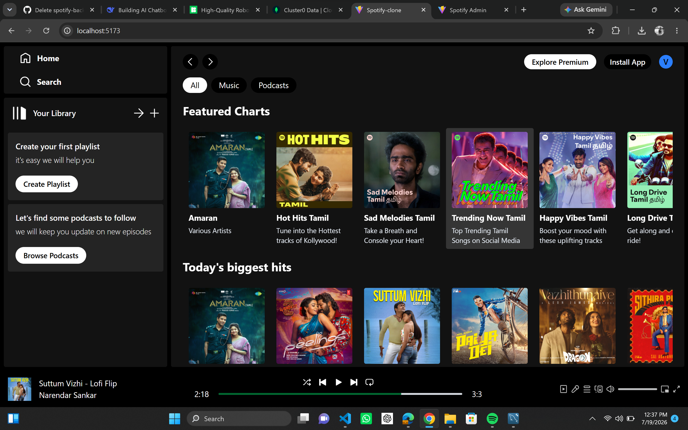
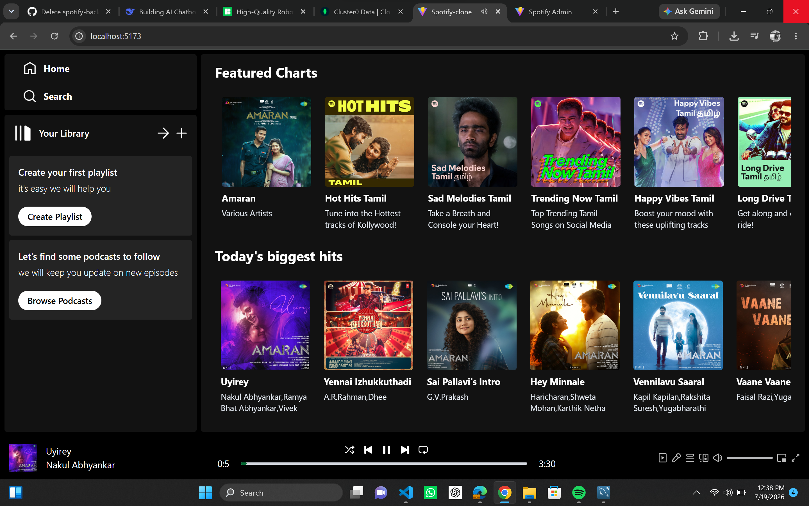
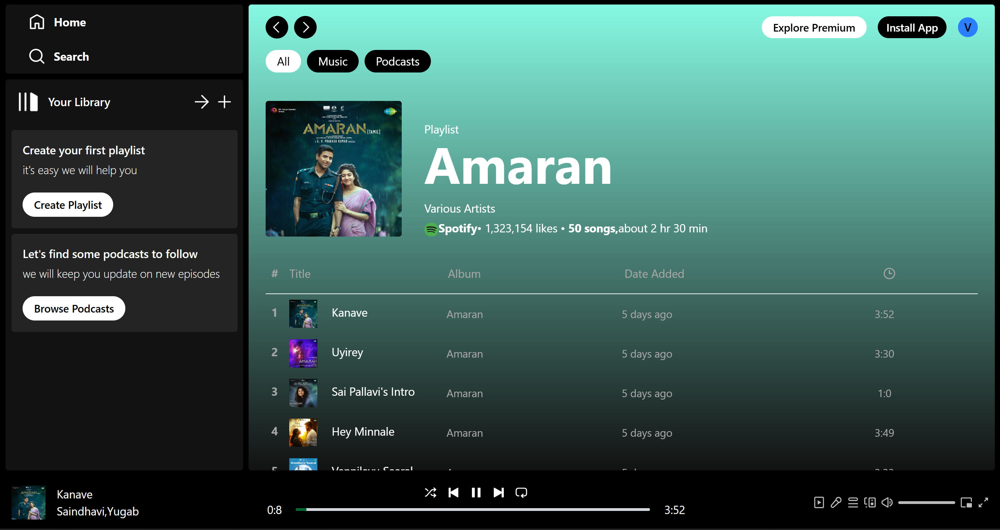
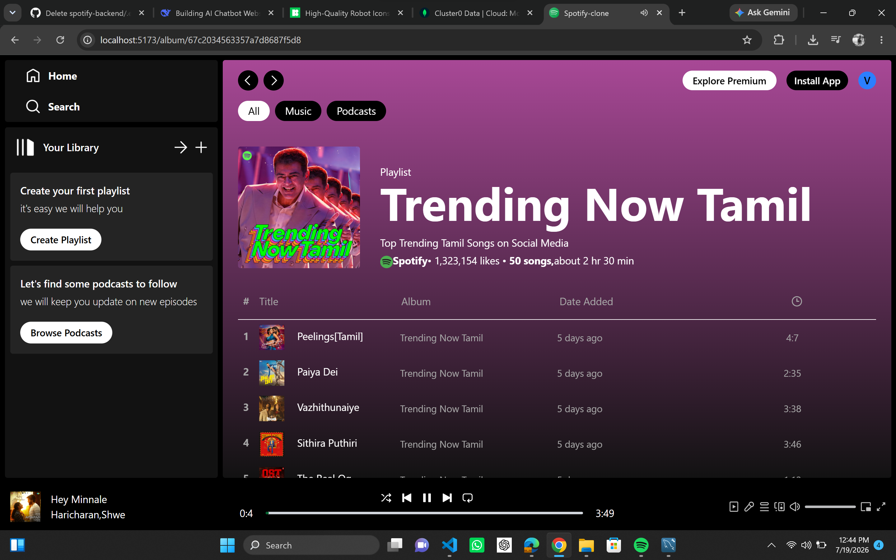
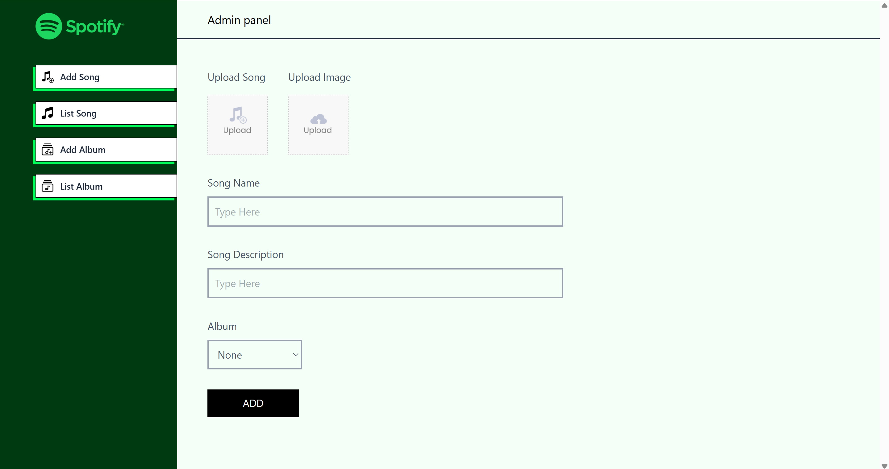
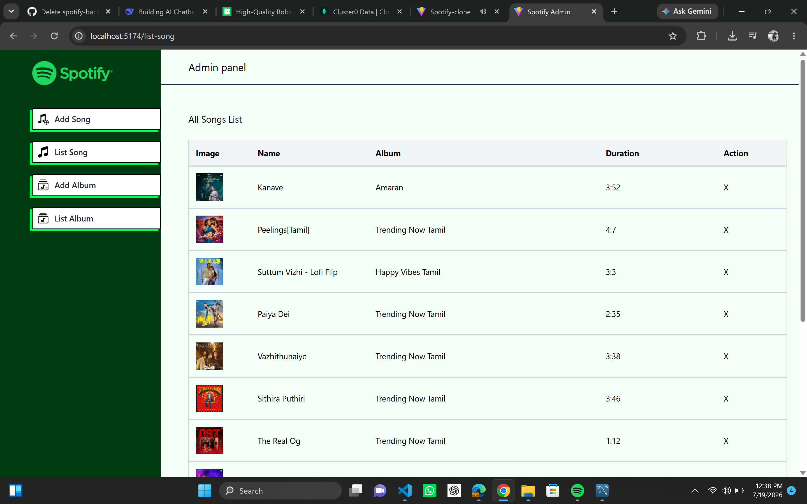
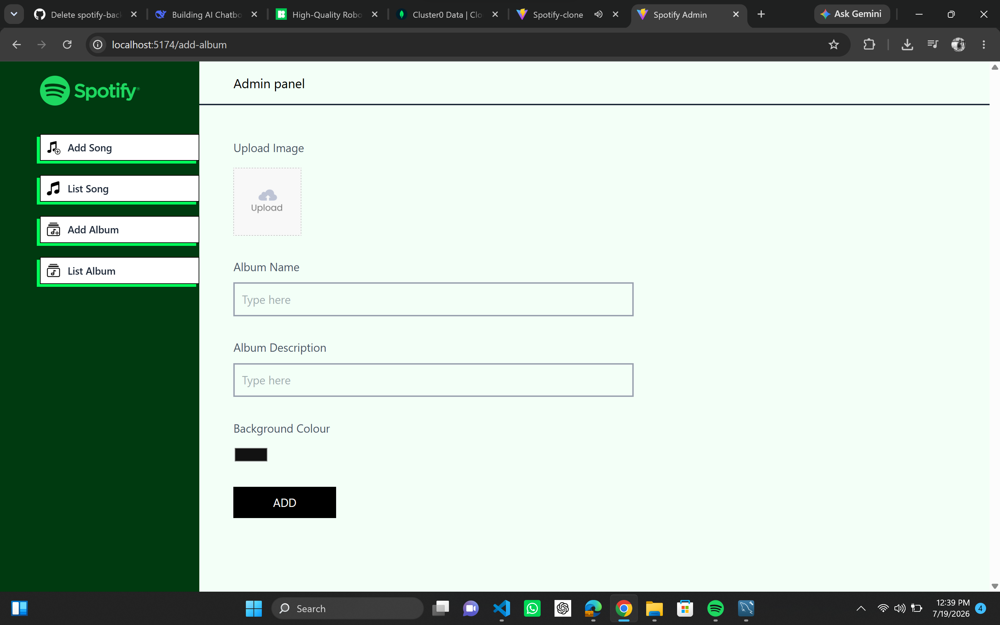
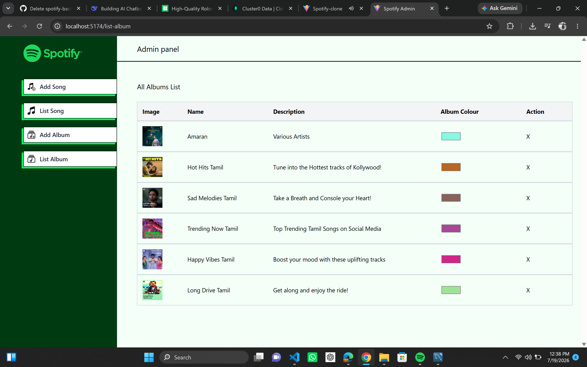

# 🎵 Spotify Clone

A full-stack music streaming application built with the MERN stack, allowing users to stream music, explore albums, and manage playlists, while providing an admin dashboard for managing songs and albums.

## 🛠️ Tech Stack

- ⚛️ React.js
- 🟢 Node.js
- 🚂 Express.js
- 🍃 MongoDB
- ☁️ Cloudinary
- 🎨 CSS

## ✨ Features

- User authentication
- Music streaming
- Browse featured songs
- Album and playlist browsing
- Song playback controls
- Admin dashboard
- Song management (CRUD)
- Album management (CRUD)
- Upload songs and album artwork
- Responsive user interface

## 📸 Screenshots

### 🏠 Home Page

### 🎧 Featured Songs

### 📀 Playlists

### ➕ Add Song (Admin)

### 🎼 Songs List (Admin)

### ➕ Add Album (Admin)

### 📚 Albums List (Admin)

